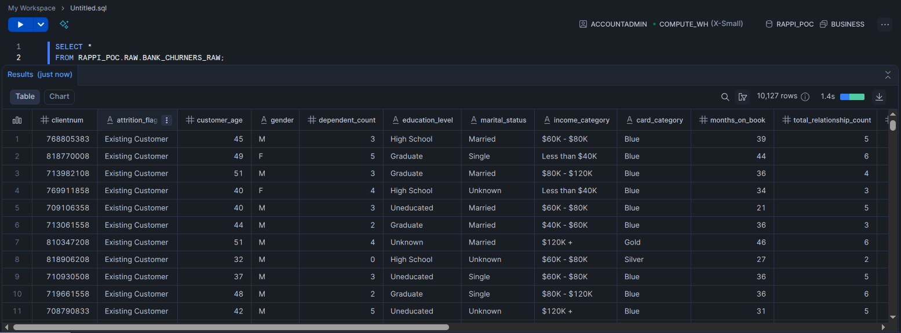
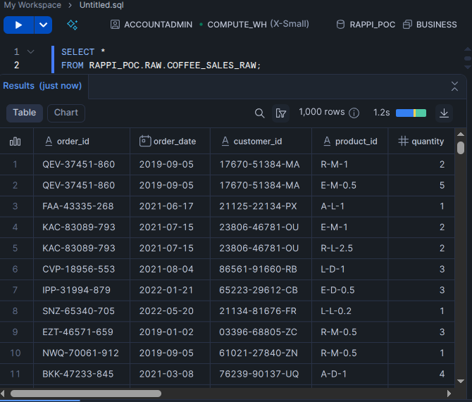
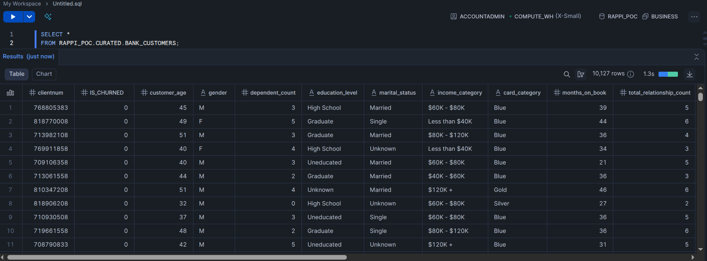
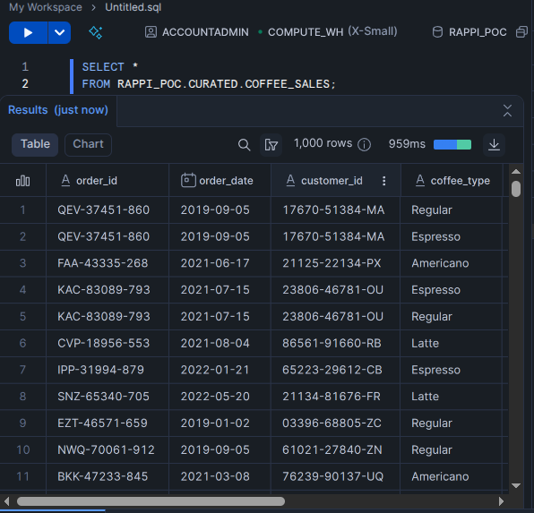
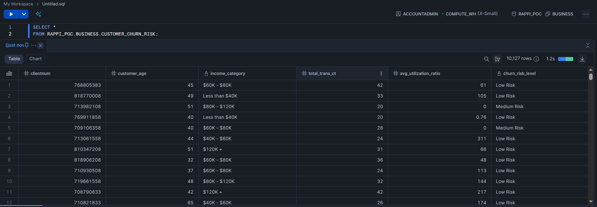
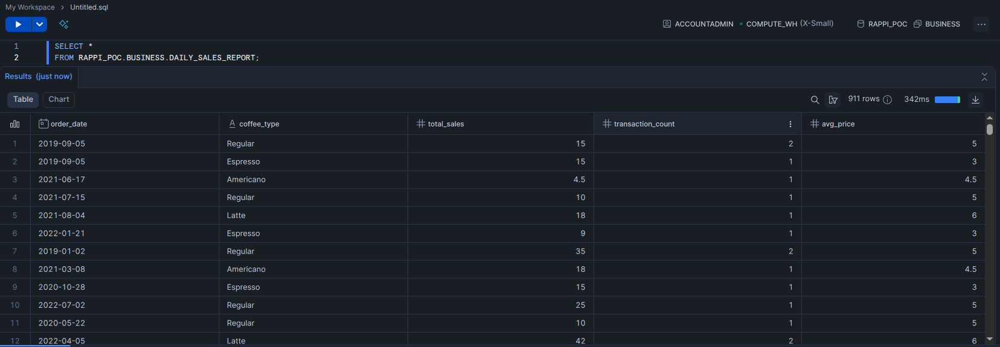

# 🚀 Data Pipeline Proof of Concept for Rappi

Este repositorio contiene una **prueba de concepto (POC)** desarrollada como parte de una implementación de la **arquitectura Medallion** (Bronze → Silver → Gold) en **Snowflake**, diseñada para ingestar, transformar y exponer datos listos para análisis.. El objetivo es demostrar habilidades prácticas en:

- Ingesta e integración de datos
- Modelamiento y arquitectura de datos
- Programación en Python y SQL
- Uso de Snowflake en GCP
- Calidad, trazabilidad y buenas prácticas de ingeniería de datos

---

## 🎯 Objetivos

- Crear una infraestructura reproducible en Snowflake (warehouses, base de datos, esquemas).
- Cargar datos crudos desde archivos JSON y Excel a la capa **RAW** (Bronze).
- Transformar y limpiar los datos en la capa **CURATED** (Silver).
- Generar vistas de negocio en la capa **BUSINESS** (Gold).
- Asegurar compatibilidad con orquestación mediante **Apache Airflow**.

---

## 📂 Estructura del Proyecto

snowflake-poc/
├── data/
│ ├── BankChurners.json # Datos estructurados de clientes bancarios
│ └── Coffee_Sales_Raw_Data.xlsx # Datos crudos de ventas de café
├── scripts/
│ └── ingest.py # Script principal de ingesta (Pandas) hacia capa raw en **Snowflake**
│ └── main.py # Pipeline principal de ejecución (orquestación local)
├── sql/
│ ├── 01_setup_infra.sql # Creación de warehouses, DB y esquemas
│ ├── 02_create_raw_tables.sql # Tablas en capa RAW
│ ├── 03_transform_curated.sql # Transformaciones a capa CURATED
│ └── 04_build_business_views.sql # Vistas en capa BUSINESS
├── .env # Variables de entorno (para desarrollo local)
├── venv # Entorno virtual de python (para desarrollo local)
├── requirements.txt # Dependencias de Python
└── README.md # Este archivo

---

## ⚙️ Tecnologías Utilizadas

| Capa | Tecnología |
|------|-----------|
| **Orquestación** | Python, Pandas |
| **Almacenamiento** | Snowflake (GCP) |
| **ETL/ELT** | Snowflake Connector |
| **Modelamiento** | SQL avanzado, modelo de capas |
| **Infraestructura** | Snowflake (Standard Edition), GCP |
| **Seguridad** | PAT (Programmatic Access Token), variables de entorno |

---

## 🧪 Flujos Implementados

### 1. **Ingesta de Datos**
- Carga de `BankChurners.json`: Datos de clientes bancarios con información demográfica y financiera.


- Carga de `Coffee_Sales_Raw_Data.xlsx`: Ventas de café con `Product ID` codificado (ej: R-M-1).


### 2. **Transformación Inteligente**
- Extracción de tipo de café, tipo de tostado y tamaño desde `Product ID`.
- Estimación de `Unit Price` basada en reglas de negocio (se propuso).
- Cálculo automático de `Sales = Quantity × Unit Price`.
- Limpieza de columnas irrelevantes en json.



### 3. **Modelamiento por Capas (Medallion Architecture)**
- **Raw Layer**: Datos crudos cargados tal cual.
- **Curated Layer**: Datos limpios, normalizados y validados.
- **Business Layer**: Agregaciones listas para BI (ventas diarias, riesgo de churn).



---

## 🛠️ Cómo Ejecutar el Proyecto

### 0. Requisitos
- Python 3.8+
- Cuenta de Snowflake (compatible con cuentas **Free Trial**)

### 1. Clonar el repositorio
```bash
git clone https://github.com/Pr0nel/snowflake-poc.git
cd snowflake-poc
```

### 2. Crear entorno virtual
```
python3 -m venv venv
source venv/bin/activate  # Linux/Mac
# o
.\venv\Scripts\Activate   # Windows
```

### 3. Instalar dependencias
```
pip install -r requirements.txt
```

### 4. Crea un archivo .env en la raíz del proyecto
```
SNOWFLAKE_USER=tu_usuario
SNOWFLAKE_PASSWORD=tu_contraseña
SNOWFLAKE_ACCOUNT=tu_cuenta
SNOWFLAKE_ROLE=ACCOUNTADMIN
SNOWFLAKE_WAREHOUSE=ANALYTICS_WH
```

### 5. Ejecuta el pipeline completo
```
python3 scripts/main.py
```